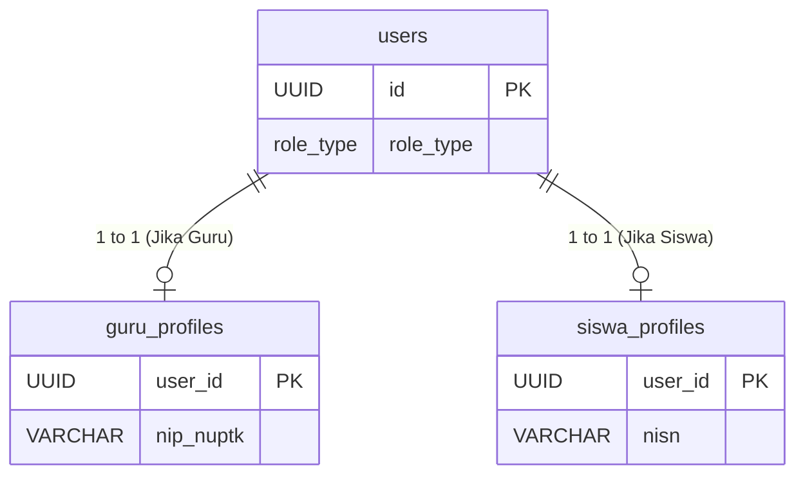
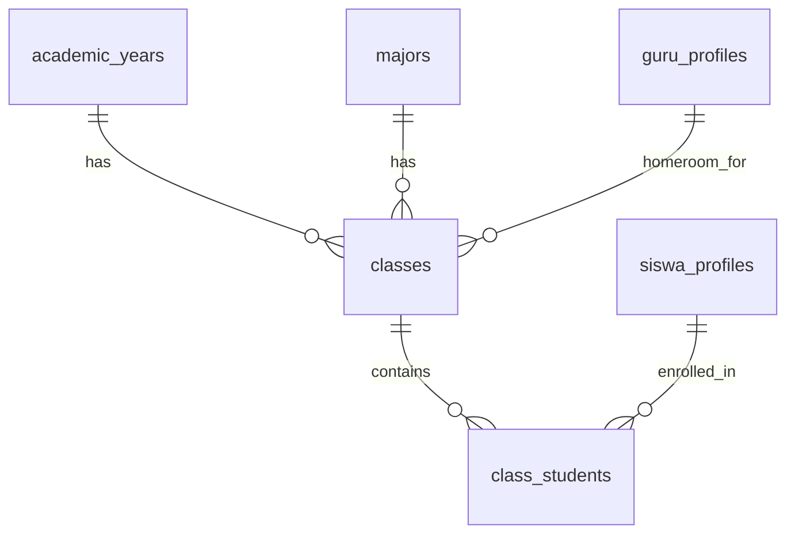
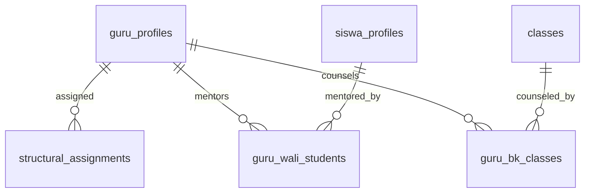
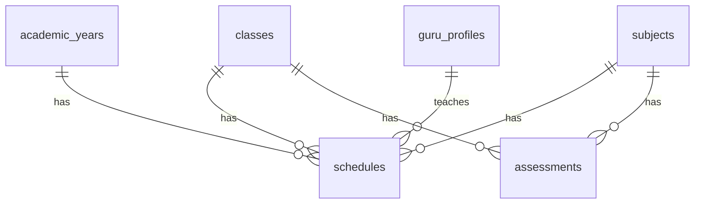
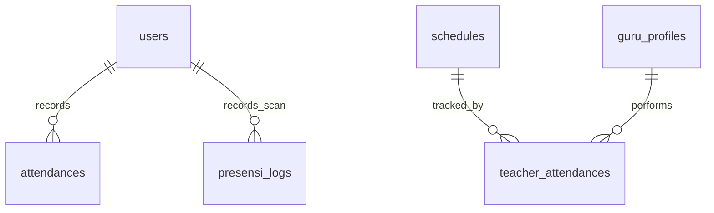
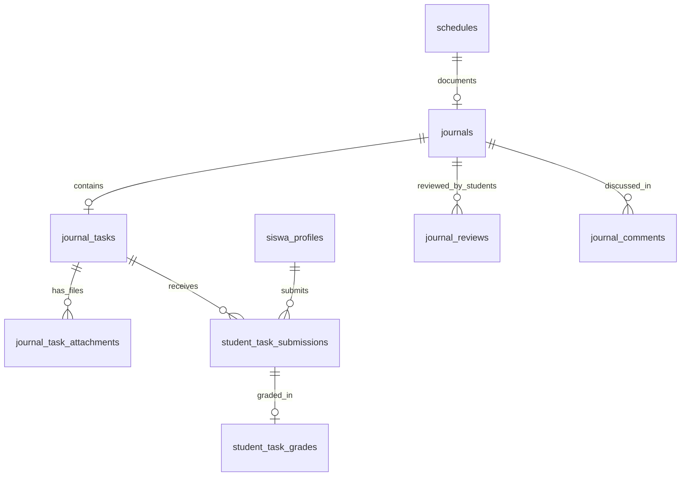
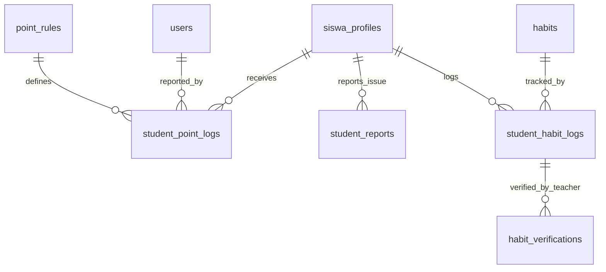
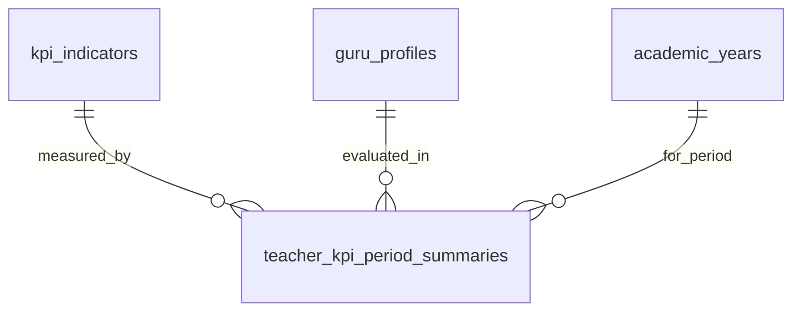
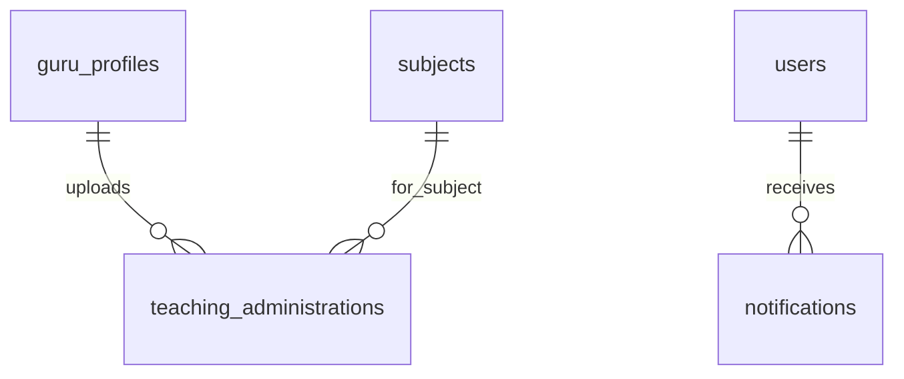

# Dokumentasi Arsitektur Relasional Database Anise

Dokumen ini membedah seluruh arsitektur database Anise ke dalam beberapa segmen fungsional. Setiap segmen dilengkapi dengan potongan diagram ERD (Entity-Relationship Diagram) khusus untuk segmen tersebut agar lebih mudah dipahami saat presentasi atau *pitching*.

---

## 1. Segmen Autentikasi & Profil Pengguna
Segmen ini mengurus sistem *login* terpusat dan pemisahan data spesifik berdasarkan peran (*role*).

**Penjelasan Relasi:**
- **`users`**: Tabel sentral untuk autentikasi (username, password, email). Semua pengguna (Siswa, Guru, Admin) masuk ke tabel ini.
- **`guru_profiles` & `siswa_profiles`**: Berelasi **1-to-1** dengan tabel `users` sebagai ekstensi data. Jika seorang `user` memiliki role `GURU`, maka data spesifiknya (seperti NIP) disimpan di `guru_profiles`. Jika role-nya `SISWA`, data spesifiknya (seperti NISN, Poin Perilaku) disimpan di `siswa_profiles`.

---

## 2. Segmen Pengaturan Akademik & Kelas
Segmen ini memetakan struktur dasar tahun ajaran, jurusan, dan penempatan siswa ke dalam kelas.

**Penjelasan Relasi:**
- **`academic_years` & `majors`**: Tabel master untuk Tahun Ajaran (Ganjil/Genap) dan Jurusan. Keduanya berelasi **1-to-Many** ke `classes` karena satu tahun ajaran/jurusan memiliki banyak kelas.
- **`classes`**: Merpresentasikan ruang kelas fisik/virtual. Berelasi langsung dengan `guru_profiles` untuk menentukan siapa Wali Kelasnya.
- **`class_students`**: Tabel *junction* (penghubung) antara `classes` dan `siswa_profiles`. Mengapa butuh tabel ini? Karena satu siswa bisa berada di kelas yang berbeda pada tahun ajaran yang berbeda (naik kelas).

---

## 3. Segmen Penugasan Struktural & Bimbingan
Segmen ini mengatur tugas tambahan guru selain mengajar di kelas.

**Penjelasan Relasi:**
- **`structural_assignments`**: Mencatat peran tambahan struktural guru (misal: Pembina Ekskul, Tim Kesiswaan) pada tahun ajaran tertentu.
- **`guru_wali_students`**: Memetakan relasi **Many-to-Many** spesifik antara 1 Guru pembimbing dengan beberapa siswa asuhnya secara personal.
- **`guru_bk_classes`**: Memetakan relasi Guru BK dengan kelas-kelas yang menjadi tanggung jawabnya.

---

## 4. Segmen Penjadwalan & Mata Pelajaran
Segmen ini adalah jantung dari Kegiatan Belajar Mengajar (KBM).

**Penjelasan Relasi:**
- **`schedules`**: Tabel penjadwalan yang sangat sentral. Ia mengikat 4 entitas sekaligus: Tahun Ajaran, Kelas, Mata Pelajaran (`subjects`), dan Guru pengajar. Relasinya mencakup hari apa dan jam berapa kelas tersebut berlangsung.
- **`assessments`**: Jadwal ujian (Ulangan Harian, UTS, UAS) yang diikat langsung ke kelas dan mata pelajaran tertentu.

---

## 5. Segmen Sistem Kehadiran (Presensi)
Segmen ini memisahkan presensi harian secara global (berdasarkan *face recognition*) dan presensi kelas per jam.

**Penjelasan Relasi:**
- **`attendances`**: Presensi harian utama siswa/guru ketika datang ke sekolah (Masuk & Pulang).
- **`presensi_logs`**: Log historis mentah (berisi foto *snapshot* wajah, titik GPS, tingkat kecocokan *AI*). Digunakan untuk audit jika ada absensi yang dicurigai palsu.
- **`teacher_attendances`**: Presensi spesifik per-mata pelajaran. Guru wajib absen berdasarkan jadwal (`schedules`) di jam mereka mengajar.

---

## 6. Segmen Jurnal Mengajar & Penugasan Siswa
Segmen ini mencatat apa yang diajarkan guru dan tugas yang dikerjakan siswa.

**Penjelasan Relasi:**
- **`journals`**: Laporan kegiatan mengajar guru. Memiliki relasi **1-to-1** atau **1-to-Many** dengan `schedules` (tergantung implementasi harian).
- **`journal_tasks` & `journal_task_attachments`**: Guru dapat melampirkan tugas beserta *file* ke dalam jurnal hari itu.
- **`student_task_submissions`**: Tabel pengumpulan tugas siswa. Menghubungkan siswa dengan tugas yang diberikan.
- **`student_task_grades`**: Relasi 1-to-1 dengan pengumpulan tugas. Menyimpan nilai dan *feedback* yang diberikan guru.
- **`journal_reviews` & `journal_comments`**: Sistem interaktif di mana siswa dapat memberikan ulasan (bintang) terhadap cara mengajar guru hari itu dan berdiskusi di kolom komentar.

---

## 7. Segmen Kedisiplinan & Pembiasaan Siswa
Segmen ini menangani poin tata tertib dan pencatatan kegiatan positif/ibadah.

**Penjelasan Relasi:**
- **`point_rules`**: Tabel master yang berisi aturan poin (contoh: Bolos = -10, Juara Kelas = +50).
- **`student_point_logs`**: Mencatat setiap transaksi poin yang masuk ke siswa. Tabel ini berelasi dengan `users` (sebagai pelapor/guru yang memberikan poin).
- **`habits` & `student_habit_logs`**: Master pembiasaan (contoh: Sholat Dhuha, Baca Buku) dan log harian pengisian siswa (disertai foto & GPS).
- **`habit_verifications`**: Guru melakukan validasi (terima/tolak) terhadap log kebiasaan yang dikirim siswa agar poin tidak dimanipulasi.

---

## 8. Segmen Penilaian Kinerja Guru (KPI)
Sistem otomatis untuk menghitung performa guru secara periodik (bulanan).

**Penjelasan Relasi:**
- **`kpi_indicators`**: Tabel master untuk indikator penilaian (Bobot absensi, Bobot ulasan siswa, dll).
- **`teacher_kpi_period_summaries`**: Tabel rekapitulasi nilai akhir bulanan guru. Kalkulasi dari absensi guru, seberapa sering mengisi jurnal, dan ulasan (*rating*) dari siswa.

---

## 9. Segmen Administrasi Guru & Notifikasi
Segmen pendukung untuk *upload* dokumen penting dan komunikasi sistem.

**Penjelasan Relasi:**
- **`teaching_administrations`**: Menyimpan dokumen RPP/Modul Ajar, ATP, atau CP yang di-upload oleh guru per mata pelajaran.
- **`notifications`**: Pusat notifikasi *real-time* untuk semua *user* (pengingat tugas, peringatan poin, dll).
