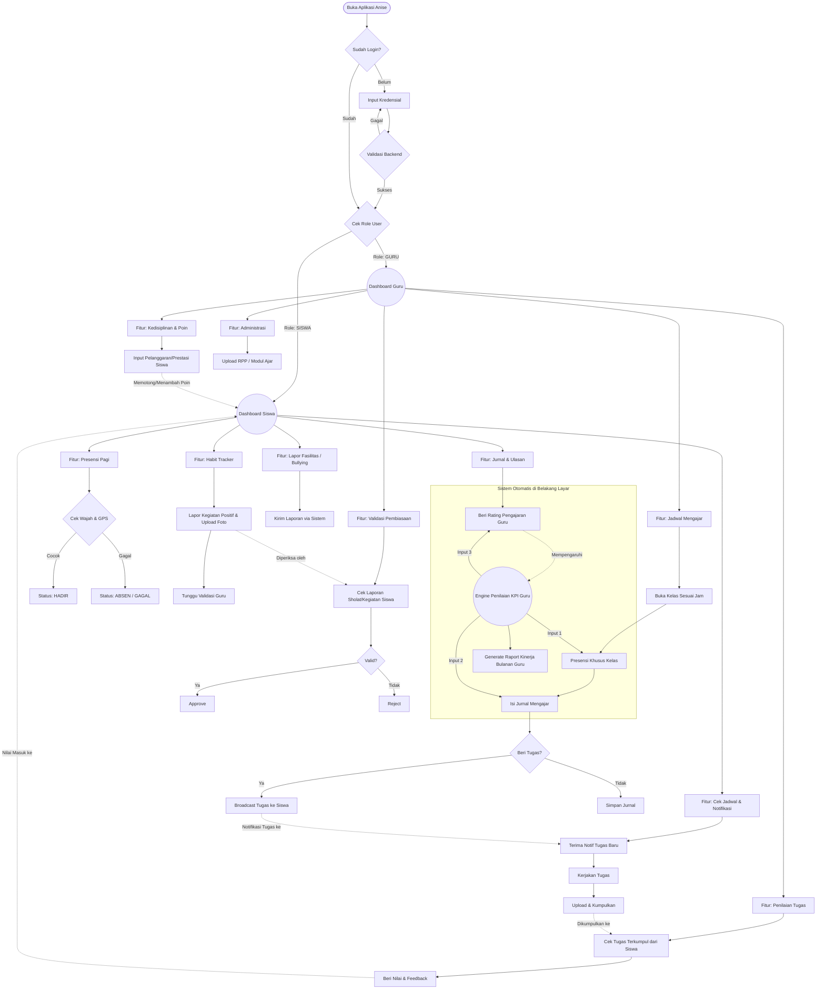

# User Flow Keseluruhan (Master Flowchart)

Dokumen ini berisi *Master Flowchart* (Alur Besar) yang menggabungkan seluruh fitur aplikasi Anise dalam satu pandangan helikopter (*helicopter view*). Diagram ini sangat berguna untuk menjelaskan *big picture* dari sistem kepada calon investor atau dewan guru.

## Cara Membaca Master Flowchart
1. **Titik Awal (Start):** Semua dimulai dari pengecekan otentikasi. Sistem otomatis membelah jalur aplikasi berdasarkan peran (*role*).
2. **Dashboard Siswa (Kiri):** Memiliki ruang gerak mulai dari melakukan presensi dengan kamera, mengerjakan tugas yang dilempar guru, memberikan *rating* ke guru, hingga melapor kegiatan positif.
3. **Dashboard Guru (Kanan):** Berfokus pada pengelolaan KBM (Isi Jurnal, Beri Tugas), mengaudit perilaku siswa (memberi hukuman poin, menyetujui kegiatan positif), dan menyelesaikan administrasi mengajar.
4. **Garis Putus-Putus:** Merupakan titik persimpangan di mana aksi Guru akan langsung dirasakan oleh Siswa secara *real-time* (dan sebaliknya). Misalnya saat guru menekan tombol "Kirim Tugas", notifikasi seketika muncul di HP Siswa.
5. **Backend Engine (Bawah):** Mewakili sistem cerdas tak kasat mata yang terus-menerus memantau data (seperti rating siswa dan frekuensi absen guru) untuk mencetak rapor kinerja (KPI) bulanan bagi setiap guru.
