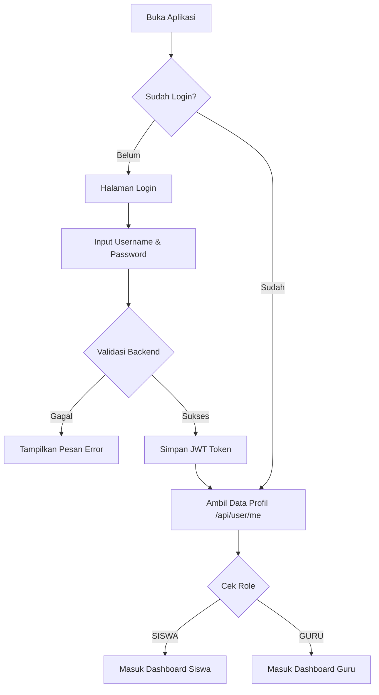
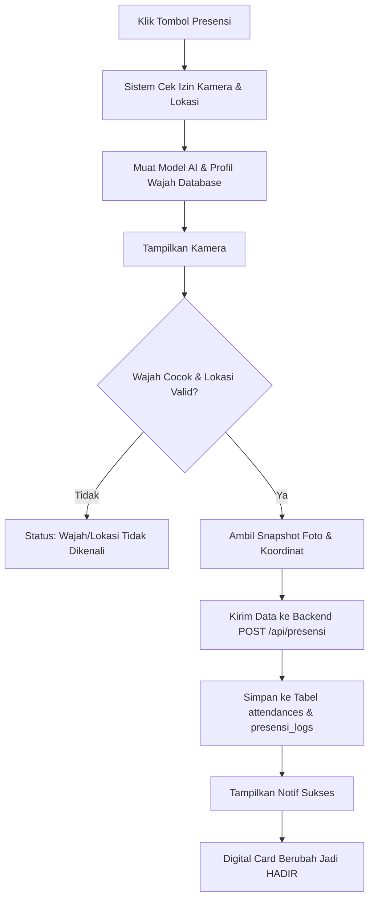
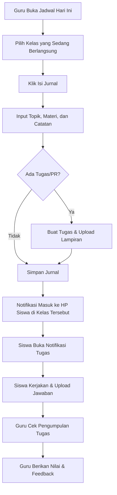
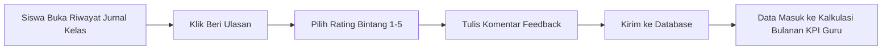
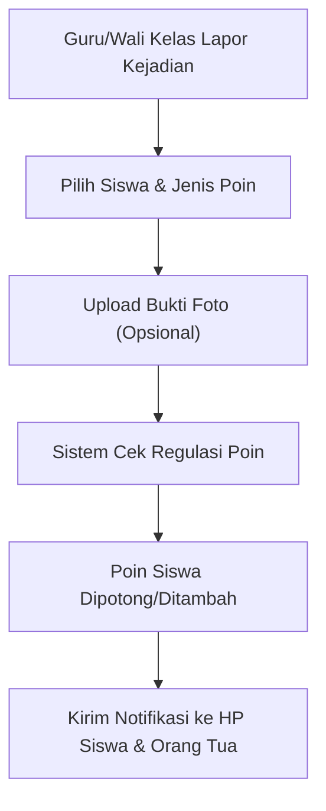
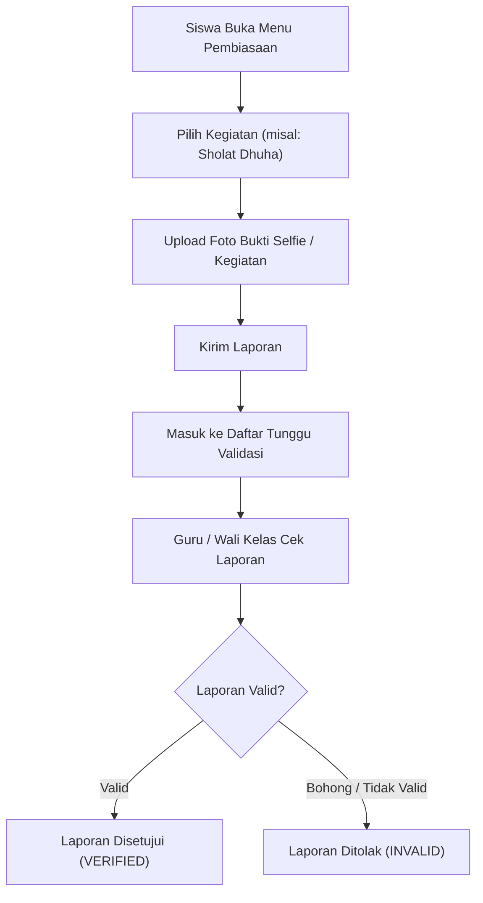
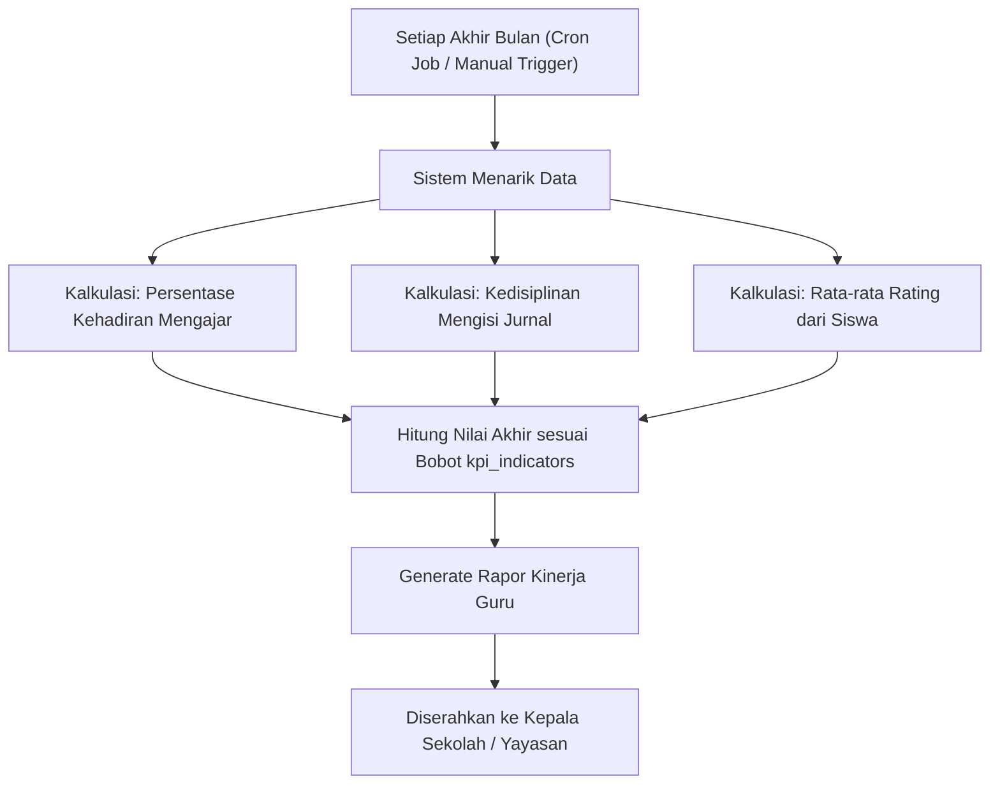

# Dokumentasi User Flow (Per Segmen)

Dokumen ini berisi *user flow* detail untuk setiap segmen utama di aplikasi Anise, dilengkapi dengan diagram alur (*flowchart*) untuk membantu memvisualisasikan bagaimana pengguna berinteraksi dengan sistem.

---

## 1. Segmen Autentikasi & Akses Awal
Alur ketika pengguna (Siswa atau Guru) membuka aplikasi pertama kali.

---

## 2. Segmen Presensi Harian (Face Recognition & GPS)
Alur ketika siswa atau guru melakukan absen harian di sekolah.

---

## 3. Segmen Kegiatan Belajar Mengajar (KBM) & Jurnal
Alur interaksi harian antara guru yang masuk kelas dan siswa yang belajar.

---

## 4. Segmen Ulasan (Rating) Pengajaran Guru
Alur bagaimana siswa memberikan umpan balik anonim terhadap cara mengajar guru.

---

## 5. Segmen Kedisiplinan & Poin Siswa
Alur ketika ada pelanggaran tata tertib atau siswa mendapatkan prestasi.

---

## 6. Segmen Pembiasaan Positif (Habit Tracker)
Alur pencatatan kegiatan positif harian siswa, seperti Sholat Dhuha atau Literasi.

---

## 7. Segmen Penilaian Kinerja Guru (KPI Bulanan)
Alur otomatisasi yang merangkum performa guru di akhir bulan.

