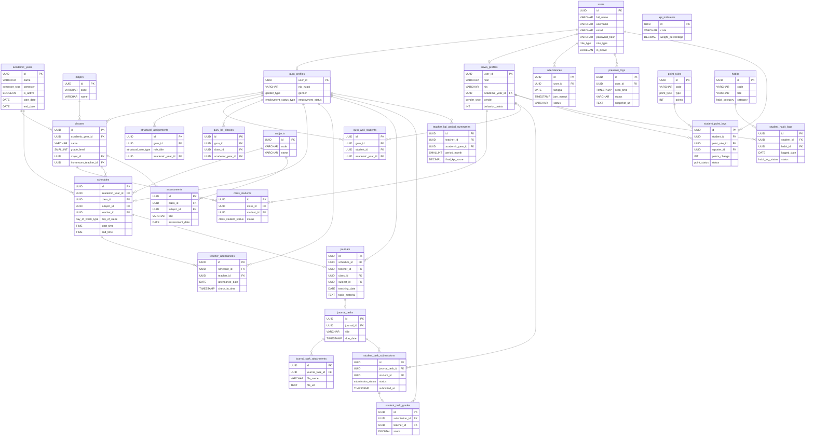

```mermaid
%%{init: {
  'theme': 'default',
  'themeVariables': {
    'fontSize': '20px',
    'fontFamily': 'arial',
    'primaryColor': '#ffffff',
    'primaryBorderColor': '#333333',
    'lineColor': '#333333'
  }
}}%%
erDiagram
    users {
        UUID id PK
        VARCHAR full_name
        VARCHAR username
        VARCHAR email
        VARCHAR password_hash
        role_type role_type
        BOOLEAN is_active
    }
    academic_years {
        UUID id PK
        VARCHAR name
        semester_type semester
        BOOLEAN is_active
        DATE start_date
        DATE end_date
    }
    majors {
        UUID id PK
        VARCHAR code
        VARCHAR name
    }
    guru_profiles {
        UUID user_id PK
        VARCHAR nip_nuptk
        gender_type gender
        employment_status_type employment_status
    }
    siswa_profiles {
        UUID user_id PK
        VARCHAR nisn
        VARCHAR nis
        UUID academic_year_id FK
        gender_type gender
        INT behavior_points
    }
    classes {
        UUID id PK
        UUID academic_year_id FK
        VARCHAR name
        SMALLINT grade_level
        UUID major_id FK
        UUID homeroom_teacher_id FK
    }
    class_students {
        UUID id PK
        UUID class_id FK
        UUID student_id FK
        class_student_status status
    }
    structural_assignments {
        UUID id PK
        UUID guru_id FK
        structural_role_type role_title
        UUID academic_year_id FK
    }
    guru_wali_students {
        UUID id PK
        UUID guru_id FK
        UUID student_id FK
        UUID academic_year_id FK
    }
    guru_bk_classes {
        UUID id PK
        UUID guru_id FK
        UUID class_id FK
        UUID academic_year_id FK
    }
    subjects {
        UUID id PK
        VARCHAR code
        VARCHAR name
    }
    schedules {
        UUID id PK
        UUID academic_year_id FK
        UUID class_id FK
        UUID subject_id FK
        UUID teacher_id FK
        day_of_week_type day_of_week
        TIME start_time
        TIME end_time
    }
    attendances {
        UUID id PK
        UUID user_id FK
        DATE tanggal
        TIMESTAMP jam_masuk
        VARCHAR status
    }
    presensi_logs {
        UUID id PK
        UUID user_id FK
        TIMESTAMP scan_time
        VARCHAR status
        TEXT snapshot_url
    }
    teacher_attendances {
        UUID id PK
        UUID schedule_id FK
        UUID teacher_id FK
        DATE attendance_date
        TIMESTAMP check_in_time
    }
    journals {
        UUID id PK
        UUID schedule_id FK
        UUID teacher_id FK
        UUID class_id FK
        UUID subject_id FK
        DATE teaching_date
        TEXT topic_material
    }
    journal_tasks {
        UUID id PK
        UUID journal_id FK
        VARCHAR title
        TIMESTAMP due_date
    }
    journal_task_attachments {
        UUID id PK
        UUID journal_task_id FK
        VARCHAR file_name
        TEXT file_url
    }
    student_task_submissions {
        UUID id PK
        UUID journal_task_id FK
        UUID student_id FK
        submission_status status
        TIMESTAMP submitted_at
    }
    student_task_grades {
        UUID id PK
        UUID submission_id FK
        UUID teacher_id FK
        DECIMAL score
    }
    point_rules {
        UUID id PK
        VARCHAR code
        point_type type
        INT points
    }
    student_point_logs {
        UUID id PK
        UUID student_id FK
        UUID point_rule_id FK
        UUID reporter_id FK
        INT points_change
        point_status status
    }
    kpi_indicators {
        UUID id PK
        VARCHAR code
        DECIMAL weight_percentage
    }
    teacher_kpi_period_summaries {
        UUID id PK
        UUID teacher_id FK
        UUID academic_year_id FK
        SMALLINT period_month
        DECIMAL final_kpi_score
    }
    habits {
        UUID id PK
        VARCHAR code
        VARCHAR title
        habit_category category
    }
    student_habit_logs {
        UUID id PK
        UUID student_id FK
        UUID habit_id FK
        DATE logged_date
        habit_log_status status
    }
    assessments {
        UUID id PK
        UUID class_id FK
        UUID subject_id FK
        VARCHAR title
        DATE assessment_date
    }

    users ||--o| guru_profiles : ""
    users ||--o| siswa_profiles : ""
    users ||--o{ attendances : ""
    users ||--o{ presensi_logs : ""
    academic_years ||--o{ classes : ""
    majors ||--o{ classes : ""
    guru_profiles ||--o{ classes : ""
    classes ||--o{ class_students : ""
    siswa_profiles ||--o{ class_students : ""
    guru_profiles ||--o{ structural_assignments : ""
    guru_profiles ||--o{ guru_wali_students : ""
    siswa_profiles ||--o{ guru_wali_students : ""
    guru_profiles ||--o{ guru_bk_classes : ""
    academic_years ||--o{ schedules : ""
    classes ||--o{ schedules : ""
    subjects ||--o{ schedules : ""
    guru_profiles ||--o{ schedules : ""
    schedules ||--o{ teacher_attendances : ""
    guru_profiles ||--o{ teacher_attendances : ""
    schedules ||--o| journals : ""
    guru_profiles ||--o{ journals : ""
    journals ||--o| journal_tasks : ""
    journal_tasks ||--o{ journal_task_attachments : ""
    journal_tasks ||--o{ student_task_submissions : ""
    siswa_profiles ||--o{ student_task_submissions : ""
    student_task_submissions ||--o| student_task_grades : ""
    guru_profiles ||--o{ student_task_grades : ""
    point_rules ||--o{ student_point_logs : ""
    siswa_profiles ||--o{ student_point_logs : ""
    users ||--o{ student_point_logs : ""
    guru_profiles ||--o{ teacher_kpi_period_summaries : ""
    habits ||--o{ student_habit_logs : ""
    siswa_profiles ||--o{ student_habit_logs : ""
    classes ||--o{ assessments : ""
    subjects ||--o{ assessments : ""
```
